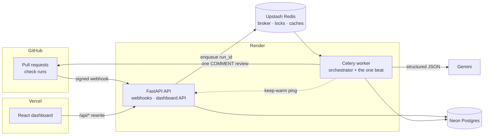
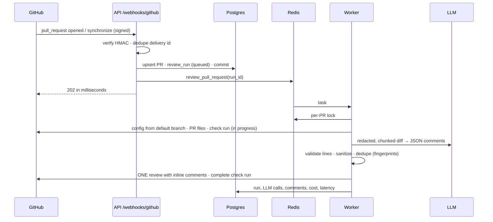

# ReviewPilot

A GitHub App that reviews pull requests with an LLM. When a PR is opened or updated, ReviewPilot reads the diff and posts **one** review with inline comments on the exact changed lines. Each comment is validated against the diff, stripped of anything unsafe, and deduplicated across pushes. A dashboard shows every review's cost, latency and whether people found it useful. An offline eval harness measures precision and recall on 30 labelled PRs, so prompt changes are judged on evidence.

**Stack:** FastAPI · Celery + Redis · PostgreSQL · Gemini (provider-agnostic) · React + TanStack Query · deployed on Render, Neon, Upstash and Vercel.

## Demo

<!-- Record with the GitHub App on your test repo: open a PR, wait for the check, then the dashboard. -->
*A demo GIF and a screenshot of a real inline review will go here once production is live (see [docs/deploy.md](docs/deploy.md)).*

## Architecture





## How it works
- **Webhook ingestion.** Verify the HMAC on the raw body, dedupe by delivery id, record, enqueue, return `202`. Nothing slow happens in the request ([ADR 0002](docs/adr/0002-queue-vs-inline-processing.md)).
- **Orchestrator.** One Celery task per run holds a per-PR lock, checks the head didn't move, and owns every side effect: GitHub calls, DB writes, the check run ([ADR 0010](docs/adr/0010-review-run-lifecycle.md)).
- **Pure engine.** Filter → redact secrets → prioritise → chunk to a token budget → LLM → validate → rank. No HTTP or DB inside, so the CLI and the eval harness run the exact same code ([ADR 0007](docs/adr/0007-pure-review-engine.md)).
- **Validation.** A comment survives only if its lines are real added lines in this diff. Output is sanitised (no @mentions, images, HTML or foreign links), and only ever posted as `COMMENT`, never approve or block ([ADR 0006](docs/adr/0006-comment-only-reviews.md)).
- **Dedupe and incremental reviews.** Fingerprints of path, category and code (not line numbers) stop repeats across pushes. A new push reviews only what changed since the last review, falling back to a full review after a force-push ([ADR 0008](docs/adr/0008-comment-fingerprints.md), [ADR 0011](docs/adr/0011-incremental-reviews.md)).

## Production metrics

From the private test repository `Ommadure/reviewpilot-playground`, via the dashboard. So far these come from the local deployment; this table will be refreshed from production.

| Reviews run | Avg cost per review | p95 latency | Helpful rate |
| --- | --- | --- | --- |
| 3 | ₹0 (Gemini free tier) | 58.7 s | 100% (2 of 2 posted comments: 👍 or fixed) |

## Security

The full checklist, with code and test evidence for every item, is in [docs/security.md](docs/security.md). The short version:
- **Webhooks:** verified with a constant-time HMAC.
- **Least-privilege App:** it only ever comments.
- **Secrets:** env-only, never logged. Users' GitHub tokens are Fernet-encrypted.
- **Dashboard sessions:** `HttpOnly; Secure; SameSite=Lax` cookies. Tenancy is enforced in the data layer and tested on every endpoint.
- **Before and after the LLM:** secrets are redacted before any LLM call, and prompt-injection defences run on both sides of it.
- **Caps:** per-run token and cost caps, plus rate-limited, permission-checked slash commands.
- **Dependencies:** audited in CI every week.

## Deploying

Render (API free + worker about $7 a month), Neon, Upstash and Vercel. The step-by-step guide is in [docs/deploy.md](docs/deploy.md), and the reasoning, including the measured Redis command budget, is in [ADR 0014](docs/adr/0014-deployment-topology.md). `render.yaml` and `frontend/vercel.json` hold the whole configuration.

## Local setup

Prerequisites: Docker with Compose v2.24+, [uv](https://docs.astral.sh/uv/), and Node ≥ 22.22.2.

```bash
cp backend/.env.example backend/.env      # fill in GitHub App values (docs/github-app-setup.md)
docker compose up --build                 # postgres, redis, api, worker, beat, flower
curl localhost:8000/api/v1/ready          # {"status":"ok",...}
cd frontend && npm install && npm run dev # http://localhost:5173
```

Backend checks, run from `backend/`:
```bash
uv sync && uv run ruff check . && uv run mypy app tests && uv run pytest   # needs `docker compose up -d postgres`
```

## Review a diff from the terminal

The review engine runs without GitHub or a database:

```bash
cd backend
git -C .. diff main > /tmp/change.patch
uv run python -m app.review.cli /tmp/change.patch                    # uses LLM_* from backend/.env
uv run python -m app.review.cli /tmp/change.patch --provider fake    # offline, no API key
```

## Dashboard

Sign in with GitHub to see only the installations you can access on GitHub (ADR 0012). It has:
- **Overview:** reviews, comments, helpful rate, cost (₹ with `USD_TO_INR`) and p95 latency.
- **Repositories:** turn automatic reviews on or off, and see each repo's config status.
- **Pull requests:** every review run on a timeline, plus **Review again**.
- **Run detail:** summary, comments grouped by file with links to GitHub, the comments validation dropped (with reasons), skipped files, and every LLM call with its tokens, cost and time.
- **Analytics:** 7, 30 or 90 days, per repository.

```bash
cd frontend && npm install && npm run dev   # http://localhost:5173, /api proxied to :8000
```

After changing the API, regenerate the typed client:
```bash
cd backend && uv run python scripts/export_openapi.py && cd ../frontend && npm run gen:api
```

## Slash commands

Comment on a pull request:

| Command | What it does | Who |
|---|---|---|
| `/reviewpilot review` | Full re-review of the latest commit (max 5 per PR per hour) | write, maintain, admin |
| `/reviewpilot summary` | Re-post the latest PR summary | anyone |
| `/reviewpilot pause` | Stop automatic reviews on this PR | write, maintain, admin |
| `/reviewpilot resume` | Turn automatic reviews back on | write, maintain, admin |
| `/reviewpilot help` | List the commands | anyone |

ReviewPilot reacts with 👀 immediately and replies with the outcome.

## Configuration

Put `.reviewpilot.yml` on the repository's **default branch** (it's never read from PR branches; see [ADR 0009](docs/adr/0009-config-from-default-branch.md)). All keys are optional:

```yaml
version: 1
enabled: true                # false = skip this repository
review_drafts: false
post_when_clean: false       # post a summary even when there are no comments
comment_on_context_lines: false
min_severity: low            # critical | high | medium | low | info
min_confidence: 0.6
max_comments: 15
focus: []                    # e.g. [bug, security]; empty = every category
ignore_paths: ["docs/**", "**/*.generated.ts"]
custom_rules:                # up to 20 rules, 300 characters each
  - "We use Pydantic v2; flag v1-style validators."
summary_language: en
```

## How usefulness is measured

ReviewPilot polls 👍/👎 reactions on its comments every 30 minutes (bot reactions don't count) and notices when an author changes the code a comment flagged.

- **Posted:** comments actually posted on GitHub (dropped comments don't count).
- **Helpful:** posted comments with at least one 👍, *or* whose flagged code the author later changed ("addressed").
- **Negative:** posted comments with at least one 👎.
- **Helpful rate** = helpful ÷ posted. **Negative rate** = negative ÷ posted.

A comment with mixed reactions counts in both, so the two rates don't add up to 100%. Both are also reported by category and by severity.

## Evaluation

An offline harness measures the review engine on 30 pull requests (25 with planted bugs, 5 clean) in Python, TypeScript, JavaScript and SQL. It reports precision, recall, F1, severity agreement, cost and latency. The full runs, what changed between prompt versions, and the reasoning are in [evals/RESULTS.md](evals/RESULTS.md). How to run it is in [evals/README.md](evals/README.md).

| Prompt · model | Precision | Recall | F1 | FP per clean PR | Severity exact | p50 latency |
| --- | --- | --- | --- | --- | --- | --- |
| v1 · gemini-3.5-flash-lite | 96% | 96% | 96% | 0.0 | 62–71% | 1.7 s |
| **v3 · gemini-3.5-flash-lite (shipped)** | 96% | 96% | 96% | 0.0 | 75% | 1.9 s |
| v3 · gemini-3.1-flash-lite | 89% | 100% | 94% | 0.4 | 60% | 5.9 s |

Every run cost $0 on the free tier. The dataset is at its ceiling for detection, so the prompt changes mainly improved severity and category calibration.

```bash
cd backend
uv run python ../evals/run_eval.py --prompt v3 --model gemini-3.5-flash-lite --pause 4 --retry-errors 2
uv run python ../evals/compare.py ../evals/results/A.json ../evals/results/B.json
```

## Docs
- [GitHub App setup](docs/github-app-setup.md)
- [Deploying](docs/deploy.md)
- [Security review](docs/security.md)
- [Architecture](docs/architecture.md)
- ADRs:
  - [0001 Record decisions](docs/adr/0001-record-architecture-decisions.md)
  - [0002 Queue vs inline processing](docs/adr/0002-queue-vs-inline-processing.md)
  - [0003 Gemini first, provider-agnostic LLM](docs/adr/0003-gemini-first-provider-agnostic-llm.md)
  - [0004 `asyncio.run` inside Celery](docs/adr/0004-asyncio-run-inside-celery.md)
  - [0005 GitHub App over OAuth App](docs/adr/0005-github-app-over-oauth-app.md)
  - [0006 Comment-only reviews](docs/adr/0006-comment-only-reviews.md)
  - [0007 Pure review engine](docs/adr/0007-pure-review-engine.md)
  - [0008 Comment fingerprints](docs/adr/0008-comment-fingerprints.md)
  - [0009 Config from the default branch](docs/adr/0009-config-from-default-branch.md)
  - [0010 Review-run lifecycle and idempotency](docs/adr/0010-review-run-lifecycle.md)
  - [0011 Incremental reviews](docs/adr/0011-incremental-reviews.md)
  - [0012 Dashboard login, sessions and tenancy](docs/adr/0012-dashboard-auth-and-tenancy.md)
  - [0013 Eval matching rule](docs/adr/0013-eval-matching-rule.md)
  - [0014 Deployment topology](docs/adr/0014-deployment-topology.md)
