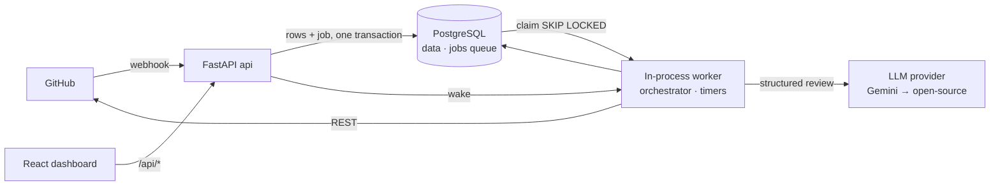
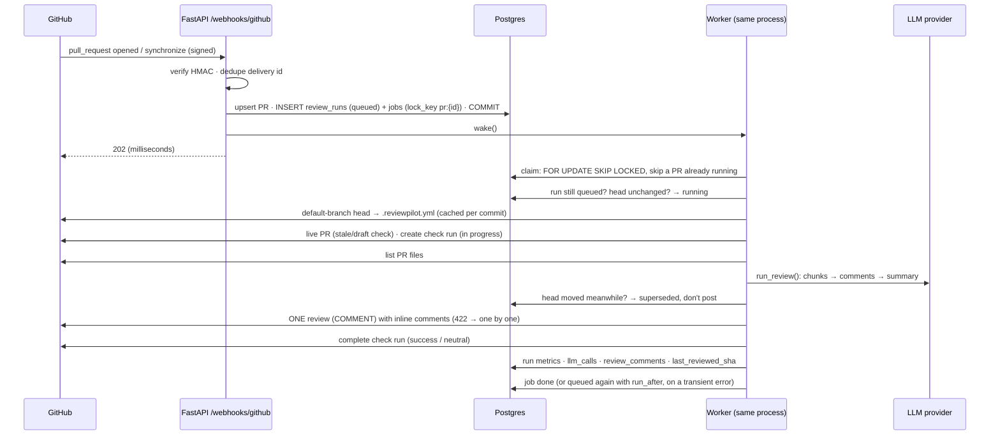
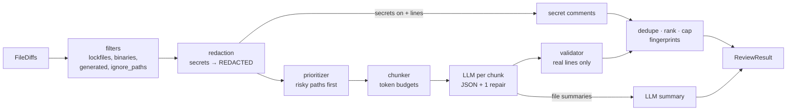

# Architecture

> Stub. It grows each phase. The full design lives in the spec (`reviewpilot_ai_pr_reviewer_prompt.md`, §3).

## Principles
1. **The webhook handler does almost nothing.** It verifies, dedupes, records and enqueues (one transaction), and returns `202` ([ADR 0002](adr/0002-queue-vs-inline-processing.md)). The queue is a Postgres table and the worker runs inside the API process ([ADR 0016](adr/0016-postgres-job-queue-in-process-worker.md)).
2. **The review engine (`app/review/`) is pure.** No HTTP, no DB. It's testable, usable from a CLI, and usable by the eval harness.
3. **The orchestrator owns all side effects.** GitHub calls, DB writes, check runs.
4. **ReviewPilot only ever comments.** It never approves or blocks a merge.
5. **All PR content is untrusted data.**
6. **Config is read from the default branch only.**
7. **Prompt changes are measured, not guessed.** The eval harness (`app/evals/`, scripts in `evals/`) runs the same pure engine over 31 labelled cases (plus a held-out set) and scores both the findings and the suggested fixes ([ADR 0013](adr/0013-eval-matching-rule.md)). Every review run records its prompt version, so evals and production can be compared.

## Webhook → review flow

## Review engine (Phase 2)

## Components
| Component | Where | Status |
|---|---|---|
| API (health, readiness) | `backend/app/main.py`, `app/api/v1/routes/health.py` | ✅ Phase 0 |
| Settings (fail-fast) | `backend/app/core/config.py` | ✅ Phase 0 |
| Job queue (`jobs` table) and in-process worker: claims, retries, orphan recovery, timers | `app/repositories/jobs.py`, `app/workers/` | ✅ ADR 0016 |
| Webhook endpoint (verify, dedupe, route) | `app/api/v1/routes/webhooks.py`, `app/services/webhook_router.py` | ✅ Phase 1 |
| GitHub App auth + in-memory token cache | `app/github/app_auth.py` | ✅ Phase 1 |
| GitHub REST client (retries, rate limits, pagination) | `app/github/client.py` | ✅ Phase 1 |
| Tables: installations, repositories, pull_requests, webhook_deliveries | `app/models/`, `alembic/versions/` | ✅ Phase 1 |
| Review pipeline (stale checks, config, posting, 422 fallback, persistence, time limit) | `app/services/orchestrator.py` | ✅ Phase 3 |
| Config from default branch, cached per commit | `app/services/config_loader.py` | ✅ Phase 3 |
| Review history tables: review_runs, llm_calls, review_comments, repo_configs | `app/models/review.py` | ✅ Phase 3 |
| Timers: stuck runs + orphaned jobs (10 min), cleanup of deliveries and finished jobs (daily) | `app/workers/` | ✅ Phase 3 |
| Incremental reviews on push, force-push fallback, PR-diff intersection | `app/review/incremental.py`, orchestrator `_plan_diff` | ✅ Phase 4 |
| Addressed / outdated detection | `app/review/incremental.py` | ✅ Phase 4 |
| Slash commands (permissions, rate limit, 👀 + reply) | `app/services/commands.py` | ✅ Phase 4 |
| Reaction polling (timer, 30 min) and usefulness metrics | `app/services/feedback.py`, `app/services/analytics.py` | ✅ Phase 4 |
| Review engine (parse, filter, redact, prioritise, chunk, LLM, validate, dedupe, summarise) | `app/review/`, `app/config/repo_config.py` | ✅ Phase 2 |
| Gemini provider + fake provider | `app/review/llm/` | ✅ Phase 2 |
| CLI | `python -m app.review.cli change.patch` | ✅ Phase 2 |
| GitHub login, encrypted user tokens, session cookie | `app/api/v1/routes/auth.py`, `app/core/security.py`, `app/services/accounts.py` | ✅ Phase 5 |
| Tenant-scoped dashboard API (cursor pagination) | `app/api/v1/routes/dashboard.py`, `app/repositories/dashboard.py` | ✅ Phase 5 |
| Dashboard SPA (React Router, TanStack Query, Recharts, generated API types) | `frontend/src/` | ✅ Phase 5 |
