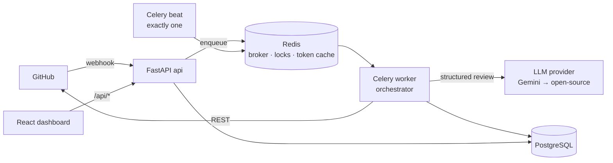

# Architecture

> Stub. It grows each phase. The full design lives in the spec (`reviewpilot_ai_pr_reviewer_prompt.md`, §3).



## Principles
1. **The webhook handler does almost nothing.** It verifies, dedupes, records, enqueues, and returns `202` ([ADR 0002](adr/0002-queue-vs-inline-processing.md)).
2. **The review engine (`app/review/`) is pure.** No HTTP, no DB. It's testable, usable from a CLI, and usable by the eval harness.
3. **The orchestrator owns all side effects.** GitHub calls, DB writes, check runs.
4. **ReviewPilot only ever comments.** It never approves or blocks a merge.
5. **All PR content is untrusted data.**
6. **Config is read from the default branch only.**

## Webhook → review flow (Phase 1)

```mermaid
sequenceDiagram
    participant GH as GitHub
    participant API as FastAPI /webhooks/github
    participant DB as Postgres
    participant Q as Redis (broker)
    participant W as Celery worker
    GH->>API: POST event (X-Hub-Signature-256, X-GitHub-Delivery)
    API->>API: verify HMAC over raw body (401 if bad)
    API->>DB: INSERT delivery ON CONFLICT (dedupe)
    API->>DB: route event: upsert installation / repo / PR
    API->>DB: COMMIT
    API->>Q: enqueue review_pull_request(pr_id, head_sha)
    API-->>GH: 202 Accepted (milliseconds)
    Q->>W: deliver task
    W->>DB: load PR; stale head? → superseded
    W->>GH: App JWT → installation token (cached in Redis)
    W->>GH: create check run (in_progress)
    W->>GH: list PR files → post review (event COMMENT)
    W->>GH: complete check run (success / neutral)
```

## Components
| Component | Where | Status |
|---|---|---|
| API (health, readiness) | `backend/app/main.py`, `app/api/v1/routes/health.py` | ✅ Phase 0 |
| Settings (fail-fast) | `backend/app/core/config.py` | ✅ Phase 0 |
| Celery app + reliability config | `backend/app/workers/celery_app.py` | ✅ Phase 0 |
| Webhook endpoint (verify, dedupe, route) | `app/api/v1/routes/webhooks.py`, `app/services/webhook_router.py` | ✅ Phase 1 |
| GitHub App auth + token cache | `app/github/app_auth.py` | ✅ Phase 1 |
| GitHub REST client (retries, rate limits, pagination) | `app/github/client.py` | ✅ Phase 1 |
| Tables: installations, repositories, pull_requests, webhook_deliveries | `app/models/`, `alembic/versions/` | ✅ Phase 1 |
| Review pipeline | `app/services/orchestrator.py` | 🚧 hello-loop only |
| Review engine | `app/review/` | Phase 2 |
| Dashboard | `frontend/` | placeholder page |
