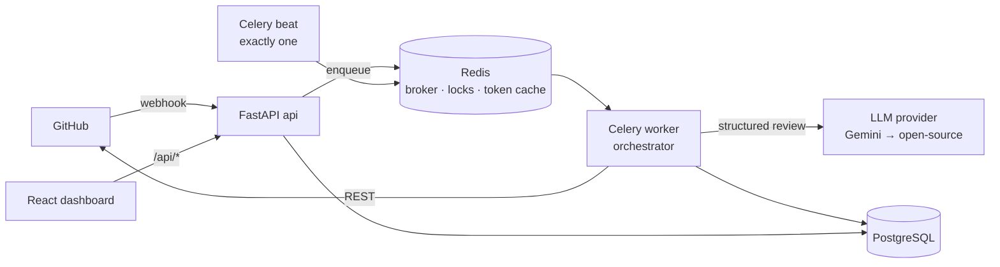

# Architecture

> Stub. It grows each phase. The full design lives in the spec (`reviewpilot_ai_pr_reviewer_prompt.md`, §3).

## Principles
1. **The webhook handler does almost nothing.** It verifies, dedupes, records, enqueues, and returns `202` ([ADR 0002](adr/0002-queue-vs-inline-processing.md)).
2. **The review engine (`app/review/`) is pure.** No HTTP, no DB. It's testable, usable from a CLI, and usable by the eval harness.
3. **The orchestrator owns all side effects.** GitHub calls, DB writes, check runs.
4. **ReviewPilot only ever comments.** It never approves or blocks a merge.
5. **All PR content is untrusted data.**
6. **Config is read from the default branch only.**

## Components (Phase 0 status)
| Component | Where | Status |
|---|---|---|
| API (health, readiness) | `backend/app/main.py`, `app/api/v1/routes/health.py` | ✅ |
| Settings (fail-fast) | `backend/app/core/config.py` | ✅ |
| Celery app + reliability config | `backend/app/workers/celery_app.py` | ✅ |
| Migrations | `backend/alembic/` | initialised, no tables yet |
| Dashboard | `frontend/` | placeholder page |
